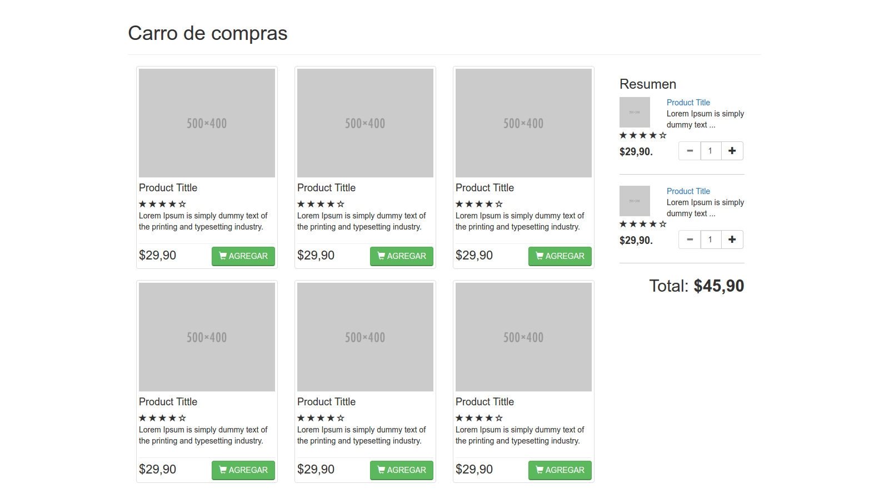

# Semana 6 - Presencial 2

Se pide construir el siguiente layout, utilizando bootstrap y sus componentes. 
Una vez construido el layout, usted debe programar (utilizando jQuery), las siguientes funcionalidades:
* Al hacer click en el botón agregar, presente en cada producto, usted debe agregar el producto al carro de compra situado al costado derecho.
* Al agregar un producto al carro de compras, usted debe actualizar el total del carro en función de los productos presentes en el carro.
* Por cada producto en el carro, podrá aumentar la cantidad de productos que desea comprar. Usted debe programar la funcionalidad que permita llevar a cabo esta acción. No olvide que al aumentar la cantidad de productos, el total se debe volver a calcular.

El layout a desarrollar es el siguiente:

__Hint:__ Utilizar objetos literales
